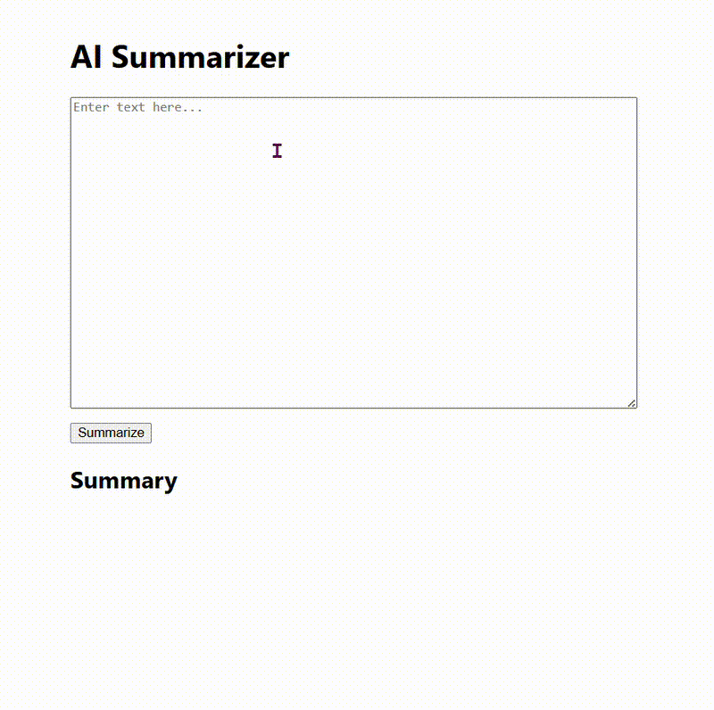

# AI Summarizer App

<!-- Badges -->


Author: @RoyH11




🚀 I created a simple web app that uses **OpenAI's GPT API** to summarize text. 
- backend: **Flask**
- frontend: **React**

> [!NOTE]
> This project is part of my full-stack code challenge in 2025. 


---

### Project Structure
```
ai-summarizer-app/
│── backend/             # Flask backend
│   ├── app.py           # Main Flask app
│   ├── requirements.txt # Python dependencies
│   ├── .env             # API keys (ignored in Git)
│── frontend/            # React frontend
│── README.md            # Documentation
│── .gitignore           # Ignore unnecessary files
```

---

### Setup

1. Backend (Flask API)
```sh
cd backend
conda create -n summarizer python=3.10
conda activate summarizer
pip install -r requirements.txt
```
Set OpenAI API key in `.env` or `~/.bashrc`, then run:
```sh
python app.py
```

2. Frontend (React UI)
```sh
cd frontend
npm install
npm start
```

---

### API Endpoint
| Method | Endpoint  | Description |
|--------|----------|-------------|
| POST   | `/summarize` | Summarizes input text |

### Example Request
```json
{
    "text": "Flask is a Python web framework."
}
```
---

### Roadmap
- [x] Backend API
- [x] Frontend UI
- [ ] Deployment

---

### License
MIT License


